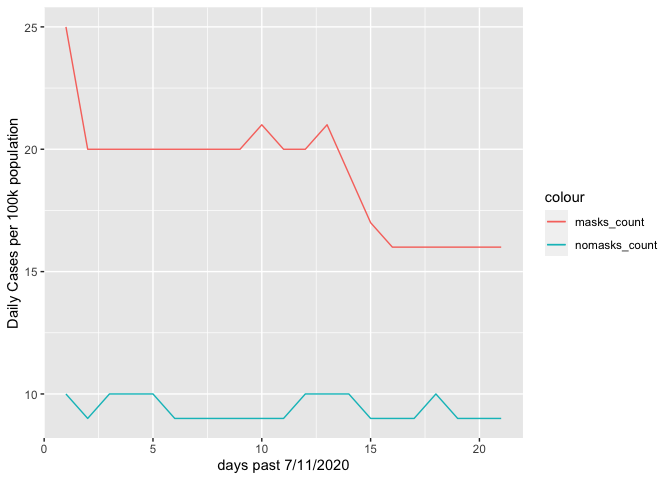

Lab 06 - Conveying the right message through visualisation
================
Group 15

### Load packages and data

``` r
library(tidyverse) 
```

### Exercise 1

``` r
df <- tribble(
  ~date, ~mask_count, ~nomask_count,
  "7/12/2020",25,10,
  "7/13/2020",20,9,
  "7/14/2020",20,10,
  "7/15/2020",20,10,
  "7/16/2020",20,10,
  "7/17/2020",20,9,
  "7/18/2020",20,9,
  "7/19/2020",20,9,
  "7/20/2020",20,9,
  "7/21/2020",21,9,
  "7/23/2020",20,9,
  "7/24/2020",20,10,
  "7/25/2020",21,10,
  "7/26/2020",19,10,
  "7/27/2020",17,9,
  "7/28/2020",16,9,
  "7/29/2020",16,9,
  "7/30/2020",16,10,
  "8/1/2020",16,9,
  "8/2/2020",16,9,
  "8/3/2020",16,9,
  )
```

### Exercise 2

``` r
df2 <- tribble(
  ~days, ~masks_count, ~nomasks_count,
  1,25,10,
  2,20,9,
  3,20,10,
  4,20,10,
  5,20,10,
  6,20,9,
  7,20,9,
  8,20,9,
  9,20,9,
  10,21,9,
  11,20,9,
  12,20,10,
  13,21,10,
  14,19,10,
  15,17,9,
  16,16,9,
  17,16,9,
  18,16,10,
  19,16,9,
  20,16,9,
  21,16,9,
)


df2 %>%
  ggplot(aes(days)) +
  geom_line(aes(y = masks_count, colour = "masks_count")) +
  geom_line(aes(y = nomasks_count, colour = "nomasks_count")) +
  labs (x = "days past 7/11/2020", y = "Daily Cases per 100k population")
```

<!-- -->

``` r
  #geom_col(mapping = aes(x = days, y = nomasks_count))
```

### Exercise 3

*Add your narrative here.*

### Exercise 4

*Add your narrative here.*
